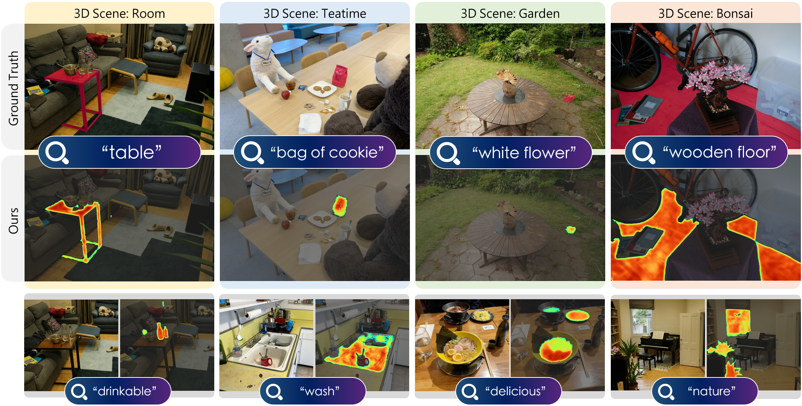

# GAGS: Granularity-Aware 3D Feature Distillation for Gaussian Splatting

This is the official PyTorch implementation of the following publication:

> **GAGS: Granularity-Aware 3D Feature Distillation for Gaussian Splatting**<br/>
> [Yuning Pang](https://pz0826.github.io/), [Haiping Wang](https://hpwang-whu.github.io/), [Yuan Liu](https://liuyuan-pal.github.io/), [Chenglu Wen](https://asc.xmu.edu.cn/), [Zhen Dong](https://dongzhenwhu.github.io/index.html), [Bisheng Yang](https://3s.whu.edu.cn/info/1025/1415.htm)<br/>
> *arXiv 2024*<br/>
> [**Full Paper**]() | [**Webpage**](https://pz0826.github.io/GAGS-Webpage/) 

## Introduction

<p align="center">
<strong>TL;DR: GAGS learns a 3D Gaussian field associated with semantic features, which enables accurate open-vocabulary 3D visual grounding in the scene.</strong>
</p>



<p align="justify">
  <strong>Abstract:</strong> 3D open-vocabulary scene understanding, which accurately perceives complex semantic properties of objects in space, has gained significant attention in recent years.
  In this paper, we propose GAGS, a framework that distills 2D CLIP features into 3D Gaussian splatting, enabling open-vocabulary queries for renderings on arbitrary viewpoints. The main challenge of distilling 2D features for 3D fields lies in the multiview inconsistency of extracted 2D features, which provides unstable supervision for the 3D feature field.
  GAGS addresses this challenge with two novel strategies. First, GAGS associates the prompt point density of SAM with the camera distances, which significantly improves the multiview consistency of segmentation results. Second, GAGS further decodes a granularity factor to guide the distillation process and this granularity factor can be learned in a unsupervised manner to only select the multiview consistent 2D features in the distillation process. Experimental results on two datasets demonstrate significant performance and stability improvements of GAGS in visual grounding and semantic segmentation, with an inference speed 2 × faster than baseline methods.
</p>

## Requirements

The code has been tested on:
- Ubuntu 20.04
- CUDA 11.8
- Python 3.8.19
- Pytorch 2.1.0
- GeForce RTX 4090.

## Installation

### Cloning the Repository

The repository contains submodules, thus please check it out with 
```shell
# SSH
git git@github.com:WHU-USI3DV/GAGS.git --recursive
```
or
```shell
# HTTPS
git clone https://github.com/WHU-USI3DV/GAGS.git --recursive
```

### Environment Setup

Our default, provided install method is based on Conda package and environment management:
```shell
conda env create --file environment.yml
conda activate langsplat
```
Then, download the checkpoints of SAM from [here](https://github.com/facebookresearch/segment-anything) and place it in the ```ckpts/``` directory.

## Training

Our training process consists of two main steps:

1. Segmentation and feature extraction using pre-trained 3DGS scene and a set of posed images.
2. Feature distillation by freezing the geometry parameters.

### Before getting started

Our model accepts datasets in the COLMAP format. Place your dataset in the ```data/<dataset_name>``` directory, and ensure the following structure:

```
<dataset_name>
|---images
|   |---<image 0>
|   |---<image 1>
|   |---...
|---sparse
    |---0
        |---cameras.bin
        |---images.bin
        |---points3D.bin
```

If your input dataset does not include image pose information (e.g., images you captured), you can use the ```convert.py``` script to extract undistorted images and SfM information, provided that COLMAP is installed. The script can also resize images (requires ImageMagick).

```shell
python convert.py -s <dataset_name> [--resize] # If not resizing, ImageMagick is not needed
```

The input format for ```convert.py``` is as follows:

```
<dataset_name>
|---input
    |---<image 0>
    |---<image 1>
    |---...
```

If COLMAP and ImageMagick are not in your environment variables, you can specify their paths using the optional ```--colmap_executable``` and ```--magick_executable``` arguments. For more details, refer to the[3D Gaussian Splatting](https://github.com/graphdeco-inria/gaussian-splatting/tree/main)

Additionally, place your pre-trained 3DGS scene in the ```output/<case_name>``` directory. We recommend using [gsplat](https://github.com/nerfstudio-project/gsplat?tab=readme-ov-file) to accelerate the process.

```
<case_name>
|---point_cloud/iteration_30000/point_cloud.ply
    |---cameras.json
    |---cfg_args
    |---chkpnt30000.pth
    |---input.ply
```

### Language Feature Extraction

Modify the corresponding parameters in ```GAS.sh``` according to the filenames in the ```data/``` and ```output/``` directories, then simply run

```shell
sh GAS.sh
```

Once completed, the ```data/<dataset_name>``` directory is expected to have the following structure.

```
<dataset_name>
|---images
|   |---<image 0>
|   |---<image 1>
|   |---...
|---sparse
|   |---0
|       |---cameras.bin
|       |---images.bin
|       |---points3D.bin
|---depth_sample
|   |---<image 0>_depth_sample.npy
|   |---<image 1>_depth_sample.npy
|   |   |---...
|---language_features
    |---<image 0>_f.npy
    |---<image 0>_s.npy
    |---...
```

### Language Feature Distillation

Modify the corresponding parameters in ```GAD.sh```, then simply run

```shell
sh GAD.sh
```

### Render and Evaluation

```shell
# rendering RGB and depth
python render.py -s $PROJ_PATH/data/$DATA_NAME -m $PROJ_PATH/output/$CASE_NAME --render_mode "RGB+ED" --foundation_model "none"
# rendering language feature
python render.py -s $PROJ_PATH/data/$DATA_NAME -m $PROJ_PATH/output/$CASE_NAME --foundation_model "sam_clip"
```

For the LERF and Mip-NeRF-360 datasets, download our annotated GT labels from [here]()(to be released) and place them in the ```data/label``` directory. Then, modify the corresponding parameters and run:

```shell
sh eval.sh
```

Our evaluation code is based on [LERF](https://github.com/kerrj/lerf) and [Langsplat](https://github.com/minghanqin/LangSplat). Special thanks to these amazing open-source projects!


<!-- ## Citation

```
@article{peng2024gags,
  title={GAGS: Granularity-Aware 3D Feature Distillation for Gaussian Splatting},
  author={Peng, Yuning and Wang, Haiping and Liu, Yuan and Wen, Chenglu and Dong, Zhen and Yang, Bisheng},
  journal={arXiv},
  year={2024}
}
``` -->

## Related Projects

We sincerely thank the excellent open-source projects:

[Langsplat](https://github.com/minghanqin/LangSplat) is the first to integrate multi-level language features into 3D Gaussian representations, advancing multi-scale language understanding.

[Feature 3DGS](https://feature-3dgs.github.io/) and [gsplat](https://github.com/nerfstudio-project/gsplat?tab=readme-ov-file) developed accessible 3D Gaussian rendering frameworks, significantly simplifying the representation and rendering of 3D language features in scenes.
